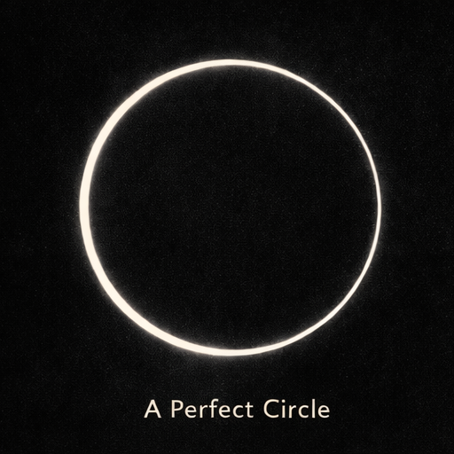
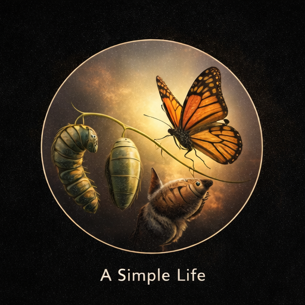
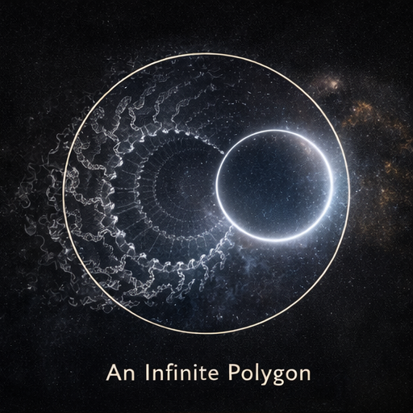
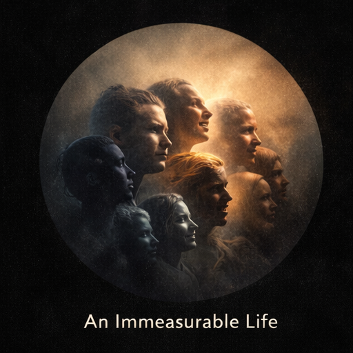
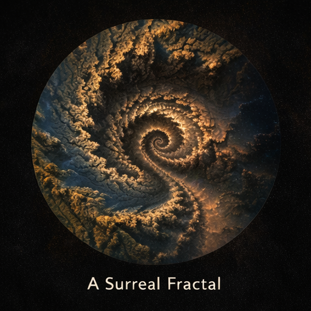
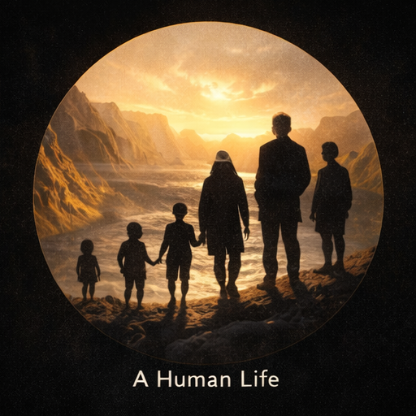

## Hakuna Matata, Shagala Bagala, Vuruga Vuruga {.text-center justify-center}

  <section class="story card top-img">

Locus of a point that moves
while keeping the same distance
from a certain other point.
Smooth. Round. Flawless. Perfect.
360 discrete degrees, yet continuous.

</section>

  <section class="story card top-img">

Birth. Walk.
Study without purpose.
Marry.
Procreate.
Raise but don't partake.
Accumulate. Age.
Die.
...
Wake up.
Excrete Maybe.
Brush. Bathe.
Travel. Sometimes.
Eat. Work. Eat.
Fuck Maybe.
Sleep.
...
Money. Status.
Love Hopefully.
Family.
Standing, if lucky.
House, with mortgage.
Content. Successful. Happy. Perfect.
Around 75 years, yet continuous.

</section>

  <section class="story card top-img">

If we could zoom out enough, they say,
An infinite polygon could be a circle.
The uncountable many sides,
Converging into an approximate perfection.
Immeasurable sides. One simple circle.

</section>

  <section class="story card top-img">

Walk. Fall. Get up. Walk. Fall. Get up.
Heart Make. Heart Ache. Heart Break. Heart Make.
Salary.
Savings Maybe.
Wealth, a little.
Desire.
Effort Maybe.
Bankruptcy or Debt.
Wealth if lucky.
Scarred. Rugged. Kind. Compassionate.
Infinite twists and infinite turns. One perfect life.

</section>

  <section class="story card top-img">

What if
you zoom in further,
a lot more than tools allow,
but imagination can reach.
And you find that
every side of that infinite polygon
is made up of infinite fjords
like the coasts of lands.
As you go further in,
you see each fjord is made of fjords too.
You observe closely,
the fjords are pulsing,
like infinite heartbeats.
3.141592
653589793
238462643
383279502
88419716
939937510...
Would you dare to call that imperfect?
Wouldn't that really be more perfect,
than what we deem to be perfect?
Wouldn't that be a lot more continuous,
than what we know as continuity?

</section>

  <section class="story card top-img">

Desire, burning fire in the belly.
Fulfillment, soothing glacial waters.
A fjord.
Contemplation, swirling darkness in the mind.
Insight, sudden divine spark.
A fjord.
Despair, sinking desert sands for the soul.
Hope, strong timely rope.
A fjord.
Mundanity, strangling grip of a python.
Creation, bursting beastly strength.
A fjord.
A Mother. A Scientist. A Clown.
A Cop. A Pirate. A King.
A fjord.
A fjord...
Would you call this ordinary?
If this is ordinary, what is extraordinary?
Devil may well be in the details,
but what is Devil, if there is no God?

</section>

