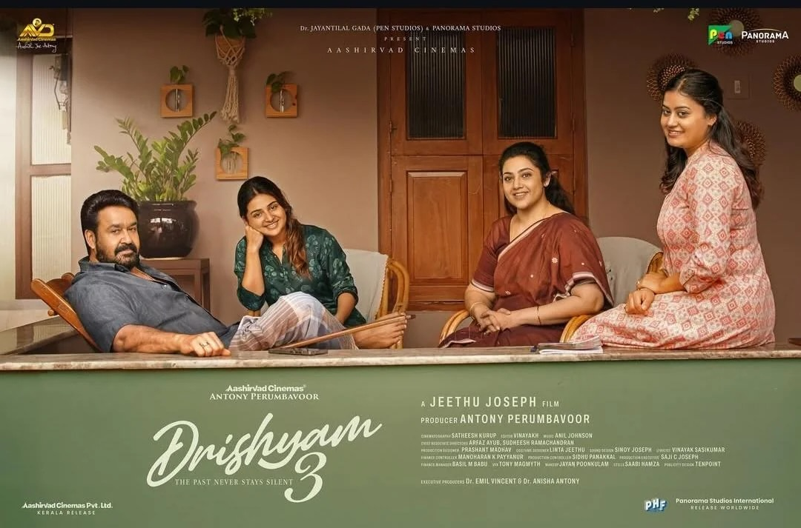

:::fullwidth

:::

Drishyam 3 is beautifully conceived and it is without a doubt a fantastic update to the franchise in terms of the story movement. It preserves the wonderful chaotic duel between unfolding of often-times preplanned sequence of events and the executive capacity of its protagonist, stretching it to pit him against a massive 2 year old scheme.

However, I found the execution of the narrative in the second half quite jarring and perhaps lacking coherence. I do think that this is somewhat intentional as the makers are also under pressure to make sure the telling has the hero present in almost every frame and witnesses the awe-inspiring win of sorts.

In this article, I will outline a re-imagination of the second half of the movie along with an alternative ending which I think fits the Drishyam trajectory better at-least for some viewers like me. Obviously, this will contain spoilers, so, if you have not seen the movie, please avoid reading any further.

## Segment 1

The first segment of the plot unravelling shows Prabakaran revealing his masterful 2 year plan to the IG. This segment is mostly retained as is, with some additional added clarity. This segment is split into two clear parts. The first part is what has already happened. The second part is what is supposed to happen.

Perspective: The Plan: What's supposed to happen 
Narrator: Prabakaran 
Audience: IG

## Segment 2

Here we take a clean break from the movie's script. Once Prabakaran reveals what is supposed to happen, we cut to the hospital. The cops question the daughter on what happened. The daughter narrates the happenings so (which is played out):

> I suddenly woke up and saw blood all over me. At a distance, Sahadevan and my husband were also pouring more blood and making marks on the wall. I screamed "What's happening, why is he here, why is there blood all over me?". Hearing me Sahadevan got angry. He yelled, "Didn't you give her the right dose?" and they started fighting. Sahadeven hit my husband and he fell on the floor and broke his neck. He looked most definitely dead. Then Sahadevan started hitting me.

> Then we heard my Dad's car racing close. Hearing this, Sahadevan picked up my husbands body and went through the back door. My dad came in and called the hospital and by that time you all came.

Then the cops call the IG. And we merge back into the script. IG yelling at Prabakaran on how Sahadevan is unreliable and the dash out.

Here we make two significant departures. First, on how it gets revealed, in this case it gets revealed at the source point: The daughter narrating, which adds more coherence and emotional grounding. Second, on the content of the revelation. The daughter clearly hints at the conspiracy. This ensures that any attempt at reversal by presenting the "clearly not dead" husband will have to contend with intent to conspire.

Perspective: The Deflection: What happened according to the daughter 
Narrator: Daughter 
Audience: Cops

## Segment 3

George's wife, second daughter and the advocate hurtle in. At this point, the final revelation is made on the actual sequence of events. In Parallel, Prabakaran and the IG get a call from the supposed to be dead husband, resulting in shock and awe.  They get another call from the cops that they have arrested Sahadevan. The IG instructs that no-one should talk to him or take a statement until he gets a chance to talk to him.

Here we take a departure by changing when and how the final revelation happens. I believe this adds lot of coherence and removes the apparent omnipresence of the hero as in the original. Additionally, this also removes the scene where George confronts Sahadevan which is chronologically extremely hard to explain.

Perspective: The Reality: What actually happened 
Narrator: George (Indirectly, the not dead husband) 
Audience: Mother, Other Daughter, Advocate (Indirectly, IG/Prabakaran)

## Bonus: Alternate Ending

IG / Prabakaran convince Sahadevan to plead guilty assuring that they will find a way to get him out.  Geeta gets down from the plane. Sahadevan's daughter is waiting to receive her. The daughter gets married to the director of George's movie and the family moves to a new home. This keeps the plot and George in full play for a possible Drishyam 4.

## Summary

While I believe that this does cut down quite a few frames for the hero worshipping audience, it compensates by removing the jarring quality of the narration, making it more coherent and keeping the plot alive. Hope this gets made in some alternate timeline and I somehow get to know how this movie fares :)
