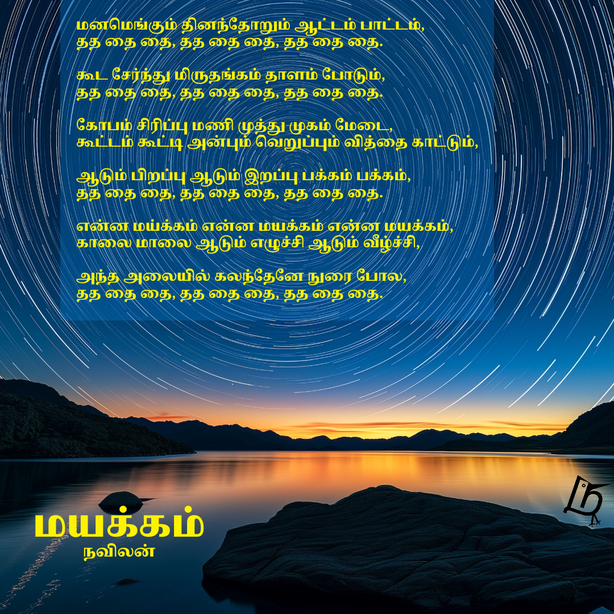

<!--more-->

திணிப்பு, வெறி, பற்று என மொழியின் பெயரில் பல்வேறு பிரிவினைவாத செயல்கள் நடக்கும் பொழுதில் மொழி என்பது நம்மை இணைக்க நாம் உருவாக்கியது என்பதை மறப்பது எளிது.

வாழ்க்கையில் எத்தனை மொழிகளை கற்க இயலும்? கற்றபின், அம்மொழியில் எத்தனை பாடல்களை சுவைக்க இயலும்? சுவைக்கயில், மொழிகளுள் எத்தனை ஒற்றுமைகள் காண இயலும்? இந்த கேள்விகளில் உண்மை, இனிமை, வியப்பு, மகிழ்ச்சி யாவும் உள்ளன. வங்க மொழி பெரும் புலவன் தாகூரின் பாடல்கள் தமிழில் கேட்க இயலுமா?

இந்த கேள்விகளுக்கு விடை அறியும் முதல் படியாக, தாகூரின் சில பாடல்களை தமிழாக்கம் செய்யும் முயற்சியை தொடங்கி உள்ளேன். இந்த முயற்சியின் இரண்டாம் உருவாக்கம், மயக்கம்.
[மமோ சித்தே][MamoChitte] என தொடங்கும் பாடலின் தமிழாக்கம், "மயக்கம்".

பாடலின் எழுத்தாக்கமும், சௌம்யா அவர்களின் இனிய குரலில் பாடலாக்கமும், இங்கு உள்ளன. சுவைத்து மகிழுங்கள்.

[MamoChitte]: https://www.youtube.com/watch?v=ZCurMjQoPe8&list=RDZCurMjQoPe8

## வங்கமும் தமிழும்

:::youtube
https://www.youtube.com/embed/7-DfLULxpIk
:::

## தமிழ் மட்டும்

:::youtube
https://youtu.be/AURopKFfWFk
:::

## தமிழாக்கங்கள்

1. [கண்மணி - அமி சீனி கொ சீனி](/ta/writings/2025/2025-08-11-bideshini)
2. [மயக்கம் -  மமொ சித்தே](/ta/writings/2025/2025-08-15-trance)
