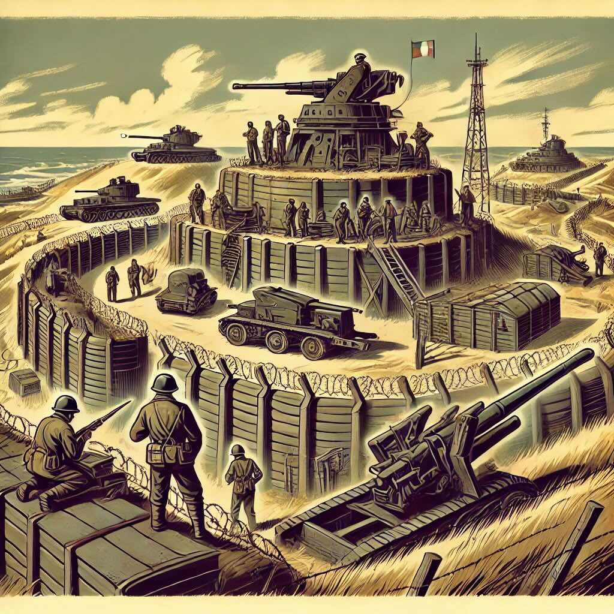
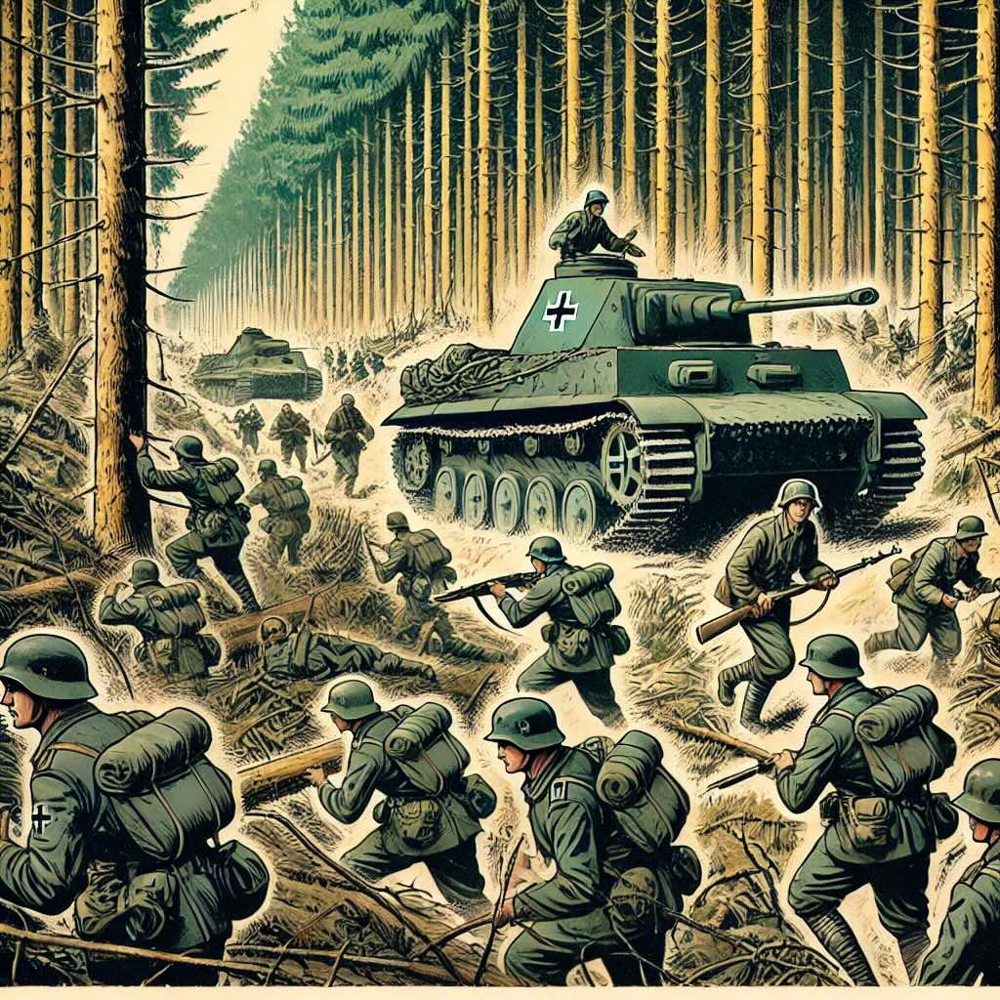
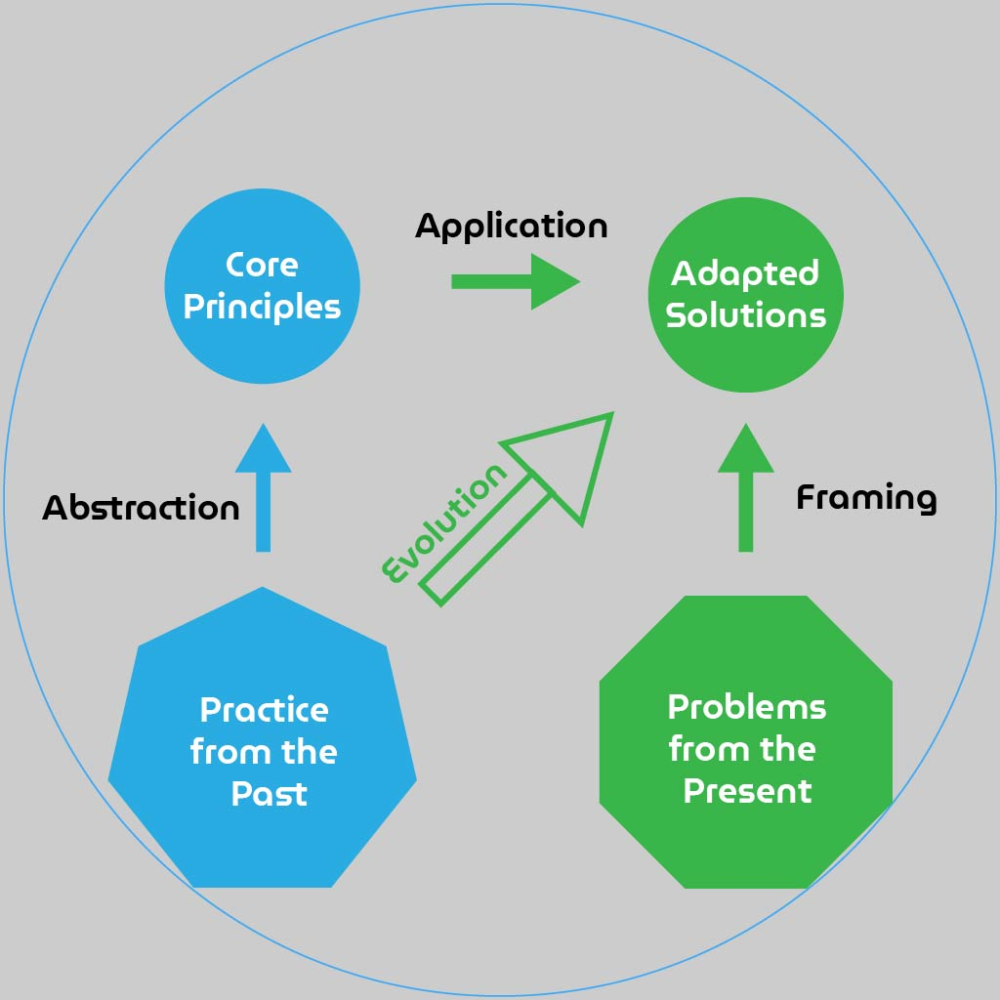
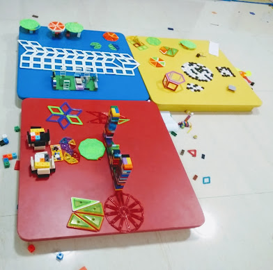

$)

<!--more-->

$if(addToc)$
$toc$
$endif$

Were you a student whose piety flared up right around the time exams came up?
I know I was. None of us should feel bad about it though. Historically,
humans in general are no different from that young student.

During times of peace and plenty, we look up to the skies and far out into the future with unflinching optimism. When strife and struggle show up, we take a reflective look within ourselves and back into the past for lessons.

If we think about it a bit, it's quite natural and in fact pretty smart and reasonable. We need to look back to avoid prior mistakes and implement successful
strategies in similar situations.

However, the past, like any place across time and space, is a mixed bag with hidden
complexities and the lessons are buried deep in puzzling mysteries. Unless we understand the present, have a reasonably reliable model of the future and a good intuition about how to learn from the past, we might take lessons that are not just unhelpful, but may turn out to be actively harmful.

## The Maginot Mistake

At the end of World War I, France, reflecting upon its immense casualties, took up
studying the war in exceptional detail. They realized that they fell short in
trench warfare and in general, static defense. They vowed not to let history repeat and got to work.

They built the Maginot line along their German border with bunkers, artillery emplacements and heaps of static defense. The only place that was left out was
the Ardennes forest, which during the time of WWI was considered impassable.

However, WWII brought other complexities. The forest was no longer impassable
for the technologically advanced German WWII troops. Static defense was no longer
a viable strategy against the coordinated mobile warfare employed by Germany.

So, what seemed like a wise and prudent path - learning from the past,
turned out to be a strategic blunder. How do we make sense of it? What is
a wise choice then?

## Understanding Complexity

Complexity of systems, tasks and behaviors change rapidly with advancements
in technology. These changes are never uni-dimensional or uni-directional. When
one aspect gets simplified other aspects gain in complexity.

Vehicles have become increasingly safe, easy to learn and operate (Better user interface). They have, however, become harder to repair and maintain. Compare the process of producing fuel for a horse to that of a car, for a stark example.

If we don't have a model for change in complexity of systems, we cannot reliably
make executive decisions towards governing much less adopting or improving those
systems. Learning from the past and adapting those lessons in the present requires
a working complexity model for the present and a fairly reliable projection for the future.

## A Fantastic System of Learning

Students learning the Vedas (in Thrissur, Kerala) are taught using a
fascinating system that ties muscle memory to cognitive memory. During
every segment of the recital, the students are also instructed on a
specific muscle movement.

The teachers hold the younger students' heads and move them when they are early learners. Later, they conduct the learning by having the students follow the
teacher's hand.

<iframe width="560" height="315" src="https://www.youtube.com/embed/Z8-xgniFP08?si=v_Kx9RZoqoVMwAXi" title="YouTube video player" frameborder="0" allow="accelerometer; autoplay; clipboard-write; encrypted-media; gyroscope; picture-in-picture; web-share" referrerpolicy="strict-origin-when-cross-origin" allowfullscreen>
</iframe>

Can we learn from this ancient system and bring it into our pedagogical
practices? For example, can we use this when teaching multiplication tables?

To avoid building our own Maginot line, let's approach our inquiry in a systemic fashion.

### Understanding the Past

This is a system of learning for the priestly class. A mistake could prove very expensive for them, for their employer or for their kingdom. They are reciting a sacred text whose very uttered sound is considered divine.

You not only have to memorize the verses, but also the exact utterance, perfected to every segment of a syllable. A mistake could be considered a bad omen for the king or kingdom. So, this is pretty much a life and death situation for those that are learning it.

The sheer amount of text to be mastered is astounding. Accounts say that it takes about 12 years to achieve mastery in one Veda. So, we can understand how important it is to get things right as early as you can.

There are a few more interesting nuggets of information that we can relish and use.

#### Age

The practice has survived several centuries with known record since 8th century AD.

"According to some scholars, there was a Padhasala at Thrikkanamathilakam, during the reign of Chera dynasty, which was considered the origin of this Vedic Institution. Later in 8th Century AD, it was shifted to Bhakthapriya temple at Thrissur. It is also said that father of Adi Sankara, Sivaguru had studied Veda residing Bhakthapriya and offered worship to the deity at Vadakkunnathan temple."

&mdash; [Brahmaswammadham History](http://brahmaswammadham.blogspot.com/p/history.html)

#### Revolutionary

According to Panini's (supposed) [original guidance][guidance], moving the head or any part of the body during a recital is not considered "good reading". This pedagogical practice seems to have evolved by overlooking the philosophical guidance for practical benefits.

[guidance]: https://sanskritpearls.blogspot.com/2009/10/october-23rd.html?m=1

### What can we infer?

* **Thriving Innovation**: There were clearly people that decided that they needed better learning systems. They found an innovative approach which I'm certain took a lot of experimentation. Such experimentation requires trust, respect and patronage of establishments and parents. So, we can conclude that it was a period of inquiry, science and quest for knowledge - accepted and feted by the society at large.

* **Challenge & Reform**: That the innovation was accepted, practiced and propagated across centuries despite a conflict with the founding guidance showcases a scientific society capable of questioning established practices and authority.

* **Learning Engineering**: There was active effort in understanding how people learn. Research on how to improve that process for better outcomes. A good process for testing and eventually implementing the improvements on a wider scale.

* **Teacher Autonomy**: In order for such a practice to have taken root, a practicing teacher or a group of teachers must have experimented to find a solution. Evidently, the teachers had sufficient autonomy and time to create and innovate.

### What should we learn?

* **The Actual Practice**: We can perhaps use the muscle memory to cognitive memory tie in for perhaps helping students memorize multiplication tables or other facts.

* **The Innovation Principle**: We must make sure many such practices that are suitable for our current age are innovated through our educators and institutions by establishing a thriving culture of creation and inquiry at schools and universities.

* **The Reformist Attitude**: Through critical inquiry, question the prevailing practices and put them to test in order to maximize the learning potential of every student.

* **Experience Engineering**: Ensure that sufficient funds are allocated to schools and research institutions, staffed with creative teachers that work with students to engineer entire learning experiences.

* **Grassroot Empowerment**: Ensure a culture of innovation starts at the grassroot level by providing teachers with sufficient training, exposure and autonomy to innovate and satisfy needs of their students.

### Is there more to learn?

Upon re-reading, I cannot shake off the feeling that "the actual practice" is the weakest link in the chain. Why so? I have a few aphorisms:

a. Principles over practices
b. Reason over rites
c. Understanding over mechanics
d. Ideas over ideologies

Here is an illustration of a solution form of these aphorisms.

### One way to evolve the practice

We can loosely apply the process above to make "the actual practice" suit our current needs.

#### The Problem

We have a massive disconnect between Math teaching and learning. There are very few students connecting to Mathematics as form of art, as a language, as a play thing.

#### Abstraction

Use muscle memory for memorization => Physical connections enhance cognitive retention.

#### Application

Create physical activities using cards, blocks and other manipulatives to make mathematics interactive so that learners connect their tactile memory with cognitive memory.

## Summary

With clouds of war looming in, people peering into the past, it is important for us as
a society to have a good grasp on what we conserve and what we let go. The key thing to remember is that past is a continuum that will include the present in the very next moment. The present has evolved organically from the past, granted, losing a great deal of value due to war, conquest, plunder and disaster. Let's look back. Let's learn. But let's not forget what we have already learnt in our recent past.
