

$)

<!--more-->

Over the past year or so, I've been busy building [SocratiQ][] in an effort to re-imagine education in the age of AI. SocratiQ also has a side-quest towards unraveling the true nature of knowledge. While I was in deep pursuit of inorganic truths, my organic matter was staging a silent revolt. A couple of months back, I was fighting off an infection. I visited the hospital and discovered that I was a full-blown Type-2 diabetic.

[SocratiQ]: https://socratiq.ai

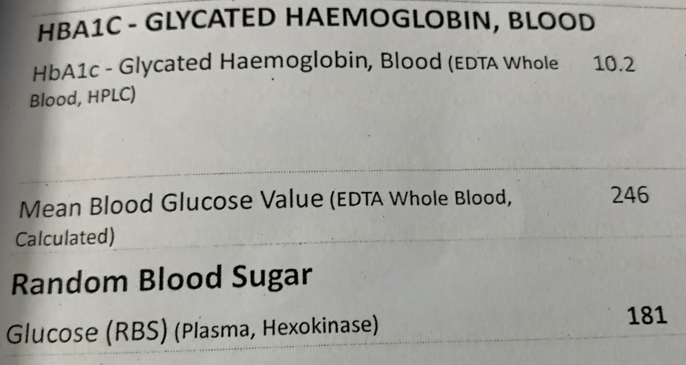
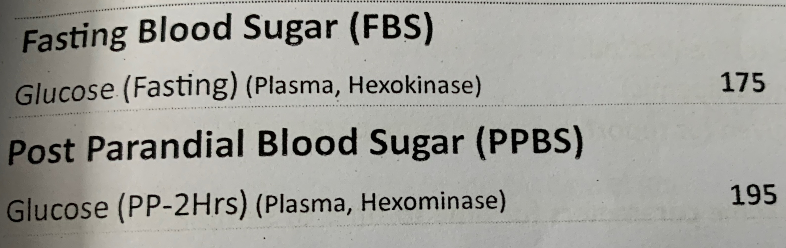

My weight hasn't changed much since my youth; however, I realized that since COVID times, I gradually replaced muscle with fat, leading to the current situation.

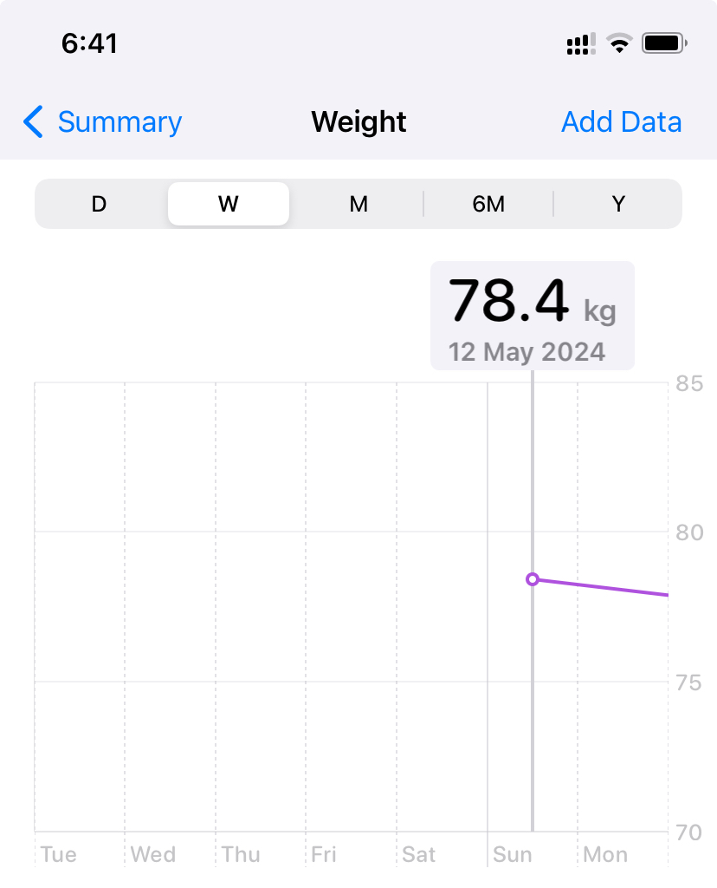

The doctor laid it all out in front of me:

1. Lose a minimum of 10 kg
2. Bring my BMI to acceptable levels
3. Make dietary adjustments
4. Make lifestyle adjustments
5. Take regular medication - Metformin + Sitagliptin, twice a day
6. Bring my blood glucose under control

Since then, I've made diffusing diabetes a short-term priority and reconfiguring my lifestyle a long-term one to some success. I'm going to walk through my journey in this article and maybe a few more if needed, hoping that it provides some useful takeaways for those on the same trip.

## Where am I now?

Determined to bring the organic matter under control, I sketched out a reasonable plan that could be put into effect tailored to my unique challenges. I'm happy to report that I've tamed the diabetes dragon and have a plan to keep it tucked away deep underground.

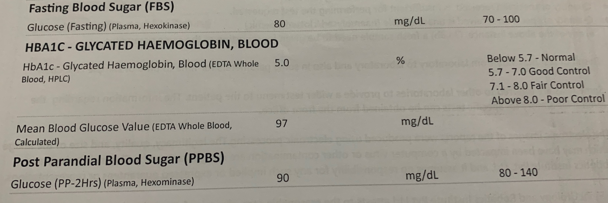

In comparison:

|                           | 13th May | 5th Aug  |
|---------------------------|----------|----------|
| HbA1c                     | 10.2     | 5.0      |
| Fasting Blood Sugar       | 175      | 80       |
| Post-prandial Blood Sugar | 195      | 90       |
| Mean Blood Glucose        | 246      | 97       |

&nbsp;

This progress is also mirrored in my health stats:

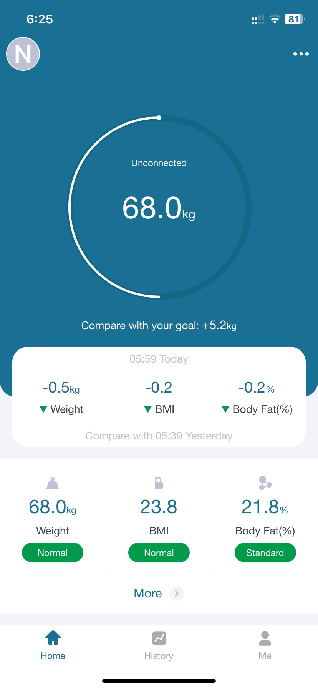
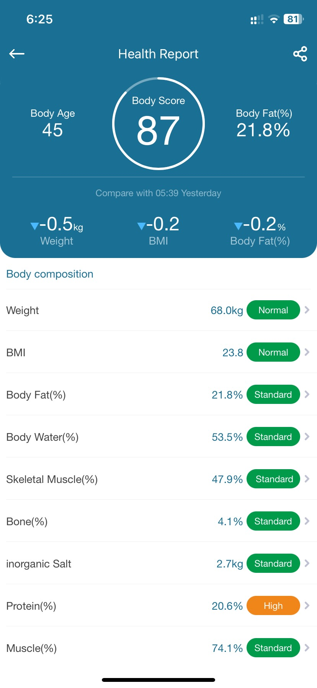
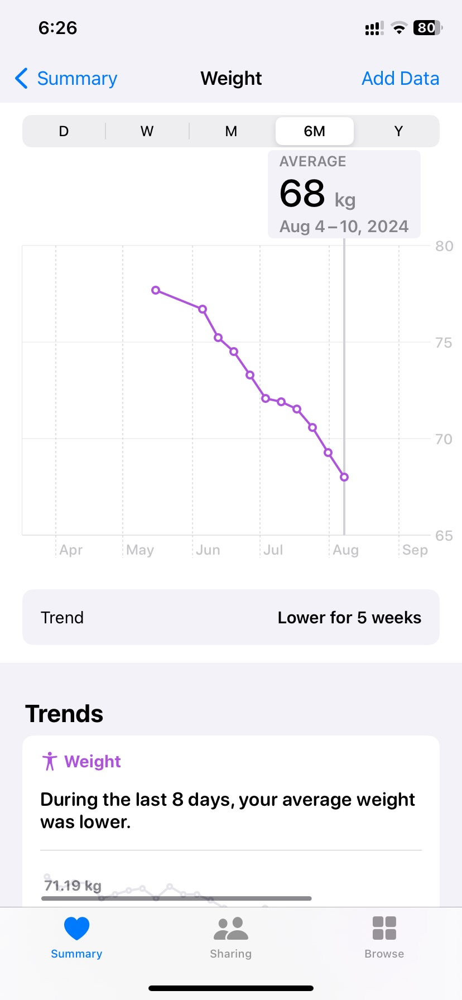

&nbsp;

### Goal Status

1. I've hit the weight target by losing above 10 kg
2. My BMI appears to be okay
3. I've completely changed my diet to be low-carb, protein rich, and generally more balanced
4. I have an active lifestyle
5. I've been on regular medication
6. Blood glucose level is completely under control

Based on these results, my doctor has advised a reduced dosage (just once a day - YAY) and in a couple of months, if things stay the same or get better, I might completely get off medication.

## Diet & Nutrition

I've completely reconfigured my diet to match my activity and weight loss needs.

1. No rice. No bread. No juices. No sugar except from fruits.
2. No potatoes except one day a week.
3. Eggs for breakfast. Compulsory meat in all other meals.
4. Black coffee with a tinge of unsweetened cocoa every morning.
5. Copious amounts of vegetables and greens.
6. Generous water intake (~4 liters).
7. Pre-workout micro energy infusion of cucumbers and onions with a dab of gingelly or olive oil.
8. Nuts and cucumber for occasional snacking.

**Potato Pangs** I was not a big rice eater and stayed off sugar except when it came to cold coffee and Tiramisu, however, staying off potatoes has been a difficult ordeal.

**Meat Mission** In 2012, I took it upon myself to break the intense psychological conditioning to become a meat eater.  The regularity was limited to once a week or two weeks though. Having meat and eggs every day has been an exceptional emotional challenge. However, it is one of the primary reasons for my current recovery and an important aspect of maintaining and continuing my progress.

**Weight Watching** I don't count calories because of the low accuracy, tedium, and extreme inconvenience when eating. Instead, I weigh myself every day, which provides similar heuristics with much better convenience.

## Workout Routine

I have a spinal fixation from 25 years back that significantly limits my workout options. Fortunately, unlike my past years where I had lost a lot of progress due to injuries, the higher protein intake in my diet has helped me maintain a good streak.

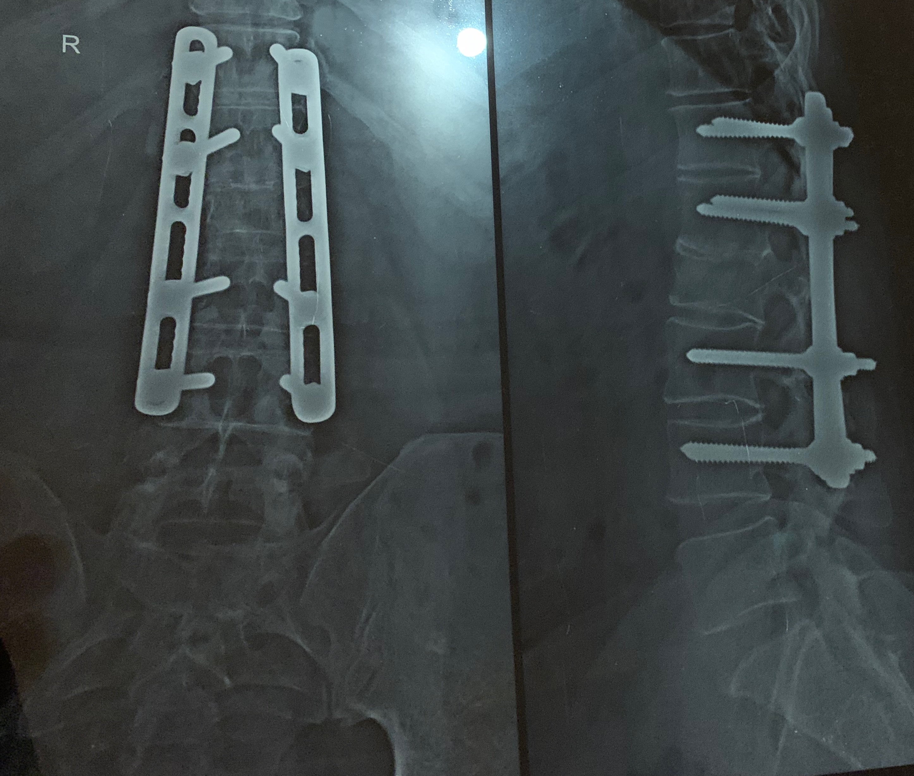

My workout routine is tailored for me to work on both my cardio fitness and strength training while decreasing the risk of injury. It's given me good results. I've been able to scale up or down based on the day's pains, gains, and needs.

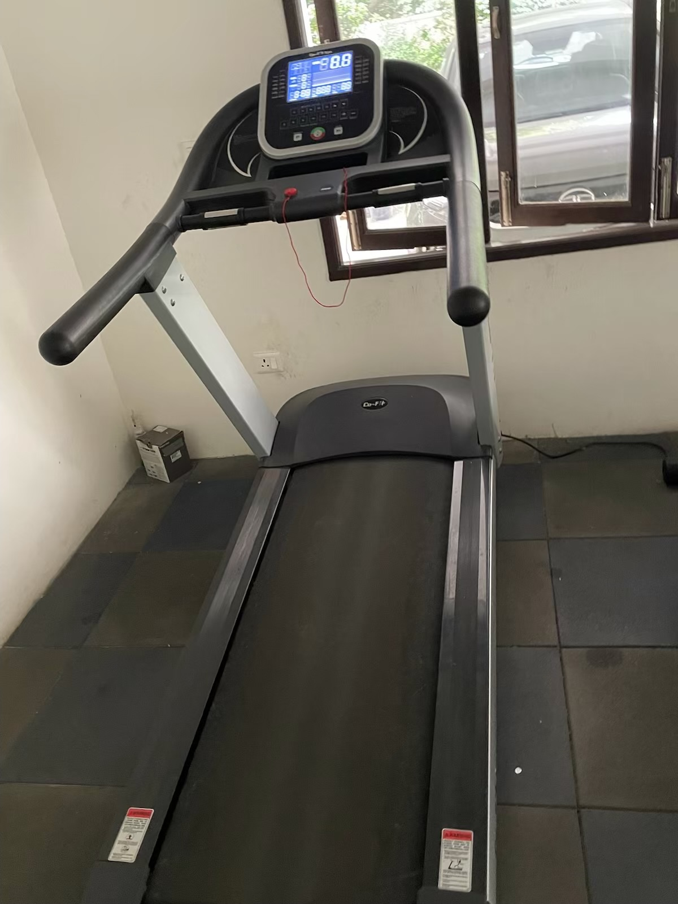
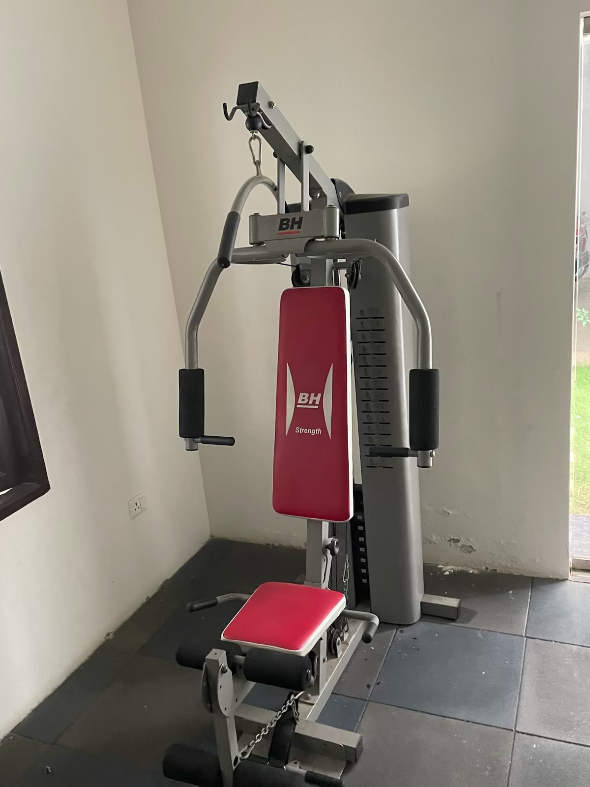

I begin my workout with an extensive mobility routine that goes up to 15 - 20 minutes. I get to gauge aches and readiness while warming up my body.

I follow it up with 3 sets of upper body and lower body work on the multi-gym. I also occasionally use the dumbbells when my body feels spiffy. I used to do some on-the-floor exercises, including plank, bridge, etc., that I've put on a temporary pause until some niggles wiggle away.

A 520-calorie treadmill walk @4.5 km/hr, 15 incline for some decent cardio follows. Together, according to my Apple Watch, I burn anywhere between 740 - 900 kcal on most days.

The pulleys, sitting-posture, conservative weighting, and controlled release have helped me minimize injuries and keep my streak going. I've been able to increase the weights and/or reps every 30 days.

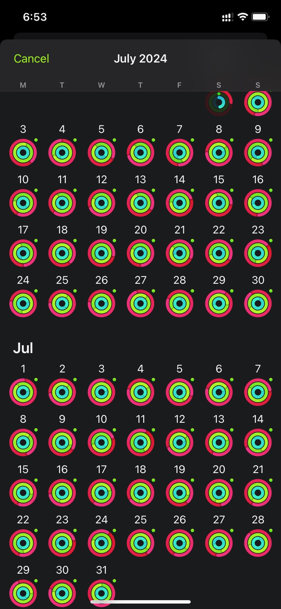
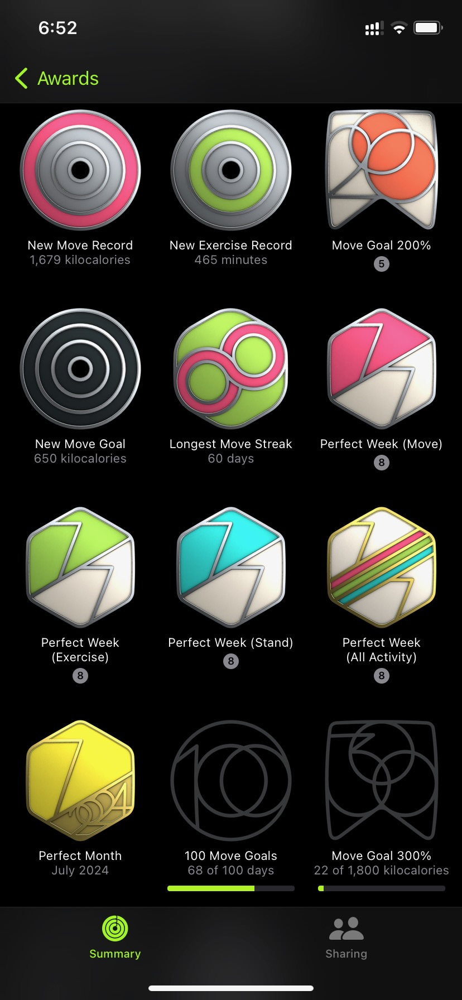

## Trusty Tools

In order to track the progress towards my goals, I've leaned on tools that are easily available and relatively inexpensive.

### Weighing Machine

[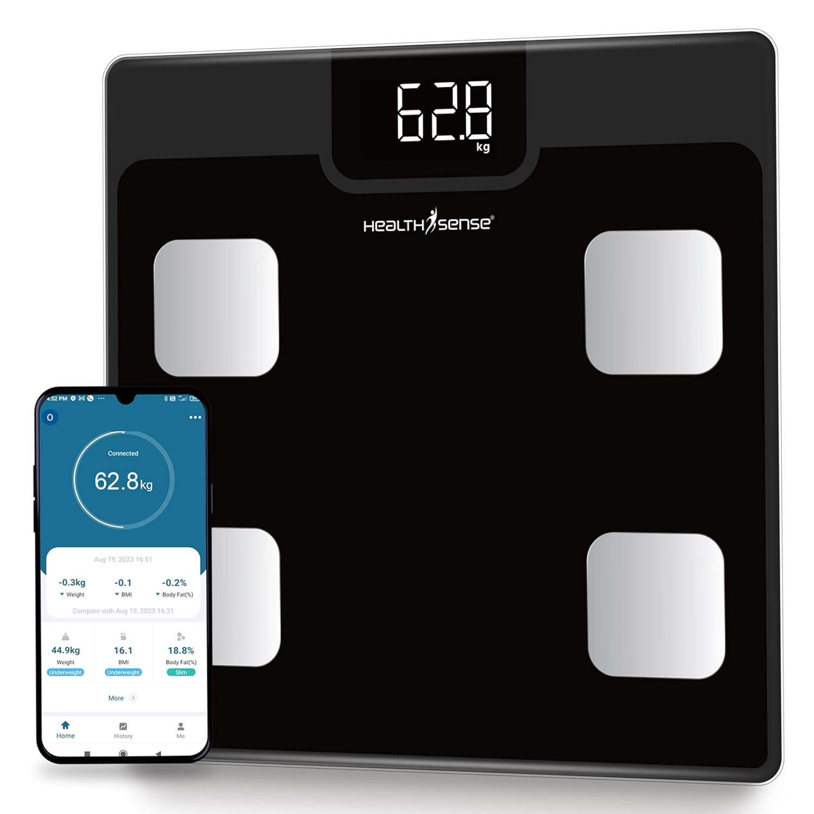](https://amzn.to/4dpzObf)

I have a weighing machine thats affordable, connects to my iPhone via Bluetooth and has Apple Health integration. Apart from the weight (which I have found to be quite reliable), it also has several other measures, including BMI, Body Fat, Muscle%, etc.

Many of the measures are based on heuristic formulae that are segmented into discrete 5 kg slabs (per my observation). I've been using these measures as indicators rather than accurate gauges of value. In other words, I pay attention to how much they change instead of how much they are.

It's not hard to fit a continuous curve based on this detection, but for my purposes of tracking the trend and observing how changes to intake and activity affect the measures, this has been more than sufficient. I might end up building something simple and tiny (maybe in Excel) if my needs change.

### Glucose Monitor

[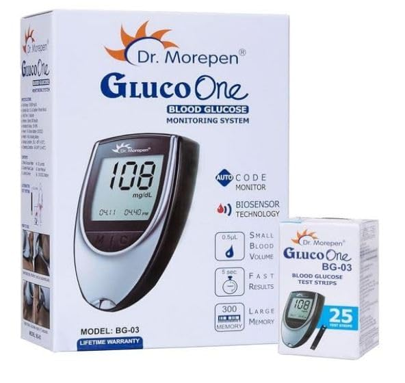](https://amzn.to/4d64eQ7)

I use an inexpensive but effective glucose monitor. Since I only take readings when I'm iffy about how I feel (I'm now mostly aware of both hyper/hypo situations), I didn't need Bluetooth integration. I add the data directly in Apple Health.

### Tracking

I have an Apple Watch Series 7 paired to an iPhone XR. Along with AirPods Pro, these form my trusted workout companions. The Health Sense weighing machine pairs with the Moving Life app, which connects to Apple Health. I track both my water intake and medications using Apple Health. Workouts and calorie spends are tracked using the fitness app and Apple Health. The difference in daily weight relative to spent calories works as an approximate indicator of my calorie intake.

## Where I need to be

I believe that getting my body back to a more optimal state for the longer term requires more planning and effort.

1. **Activity**:
    The most important aspect of diffusing diabetes (T2) and improving quality of life is building muscle mass. Increased muscle mass helps with metabolic rate and insulin sensitivity. So my strength training has to be well planned and managed as I shift from a weight-loss focussed routine to one that balances weight-loss with muscle building.

    My cozy gym and favorite equipment unfortunately are not quite enough for the task at hand. Time to upgrade.

    

    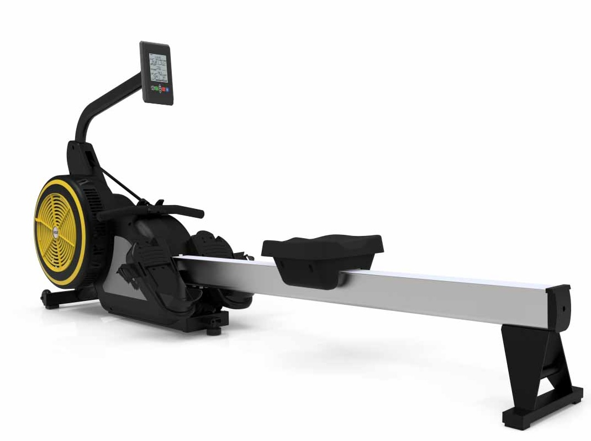

    

2. **Weight loss**:

    I've met the recommended goal to lose 10 kg. However, my estimates predict that losing an additional 6 kg while increasing muscle composition will help me achieve normalcy-restoring outcomes.

    

    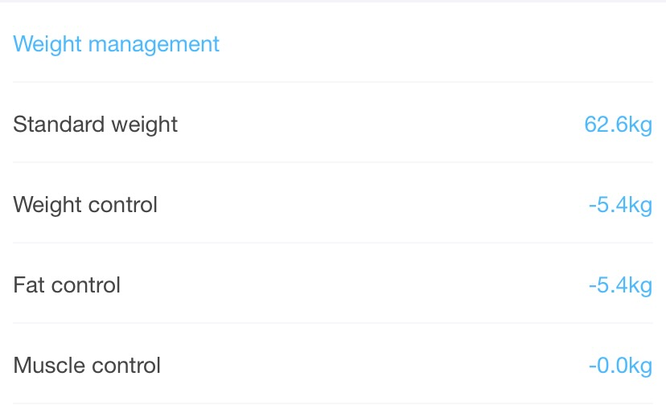
    

3. **Energy levels**:
    I'm happy that my dosage is lowered. A complete, continued, and verified remission will help me get rid of medication and restore my body's autonomy in managing energy levels.

## Some Takeaways

One of the biggest realizations I had was how fantastic it is to have a gym in the apartment. For my specific purpose, my issues with balance and back fatigue make outdoor walks not very enjoyable. I can see how a gym is indispensable as an inclusive way to build a healthy population.

### A Policy Proposal

In countries like India with a population that's trending upwards, having a policy that does the following will be a major investment towards a healthier, more productive, and happy populace.

**Regulation**: All housing communities must have one or more gyms proportional to the number of apartments. They must be functional with sufficient equipment for both strength and cardio training. There must be a qualified trainer who visits coupled with the daily functioning of the gym. This increases gainful employment and entrepreneurship opportunities that also provide significant social value.

   This does not predate on the larger gyms as younger, more athletic, or goal-driven people (like me) will always prefer them for social contact, better equipment, and intense programs. It will, however, make fitness an accessible, perceivably free, social everyday activity for citizenry that truly needs it.

**Subsidy**:
   Community gyms must also receive incentives. I can think of a few: reduced property tax, subsidized or free electricity, or equipment upgrade grants.

### Startup Opportunity

There is a great market for a startup (especially paired with a government grant/subsidy) to install such gyms and trainers for apartments. If you are a builder or a health startup founder that's keen on executing this idea, please [reach out to me](mailto:navilan@folds.in). I'd love to see some physical space designs and programs that I have in mind become real.

## In Summary

When I rejoined work with a couple of crutches after an accident, I was embarrassed to go to lunch with my colleagues. Lunch involved climbing down, painfully and uncomfortably, two flights of stairs. My presence often broke the free-flowing walk and talk.

The stairs were smoothly polished and had rounded edges. I figured that moving my feet to the edge of the stairs and slipping down made me much faster and helped me keep up with my colleagues. Weirdly enough, it also felt a lot safer than climbing down, especially with my crutches.

The human body coupled with the mind is a dynamic machine with distributed intelligence that's infinitely hackable. Type-2 diabetes is most often an easily fixable problem with some tight lifestyle choices that eventually make you feel like a million bucks even if it occasionally leaves you longing for that one thing you can't have.

Over the past 3 months, I've made my organic matter happy and I'm certain that it must be feeling secure given my rock solid plans to keep it comfortable and well nurtured. It is now time again to focus on inorganic truths and eternal knowledge.

Onward and upward!
