

$)

<!--more-->

If you have not read my [initial post][] on my diagnosis and first steps towards taking control of the disease, you might want
to [take a quick scroll through it][initial post]. This is an intermediate update on my current progress and next steps.

[initial post]: /$relToAbs("./2024-08-06-defeating-diabetes.html")$

## Health Stats

Since my last post I've lost well over 3kgs, built some muscle and on my way towards hitting my targeted goals.

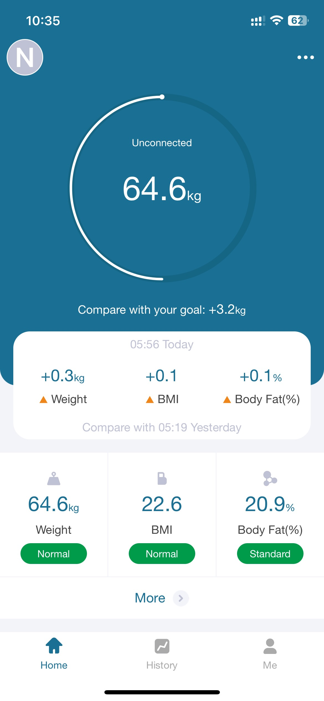
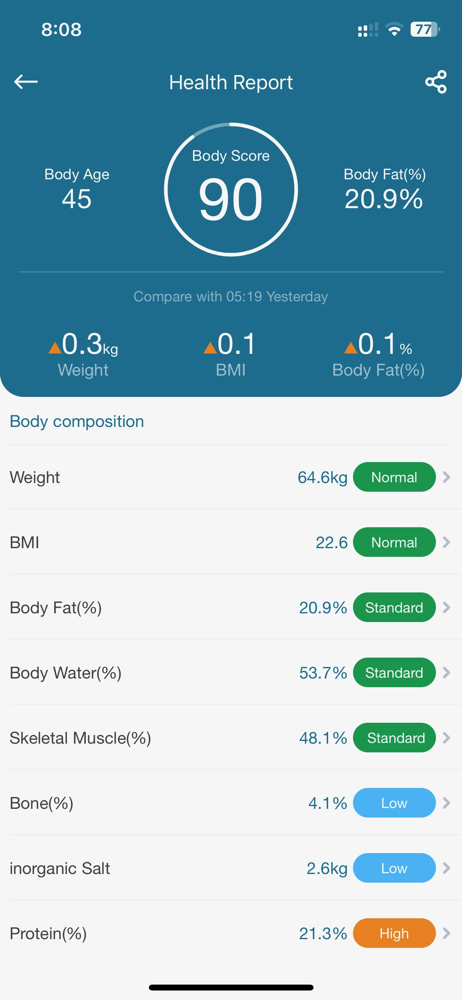

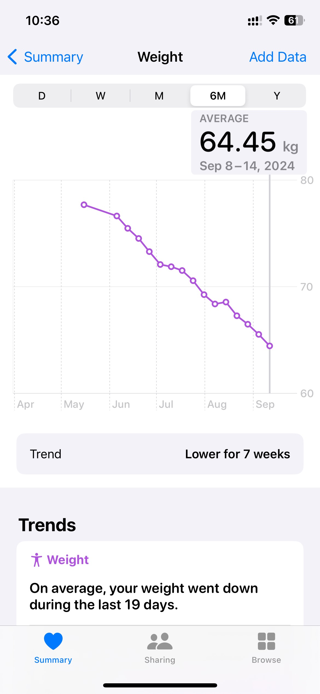
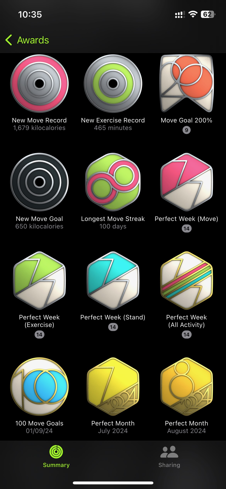

In comparison:

|                           | 6th Aug  | 9th Sep  |
|-------------------------- |----------|----------|
| Weight (Kg)                   | 68       | 64.6     |
| Blood Sugar Range (mg/dL)        | 75 - 121 | 83 - 104 |
| Medication (Metaformin/Sitagliptin)               | 2 doses  | 1 dose   |
| T-shirt size               | L     | M |

&nbsp;

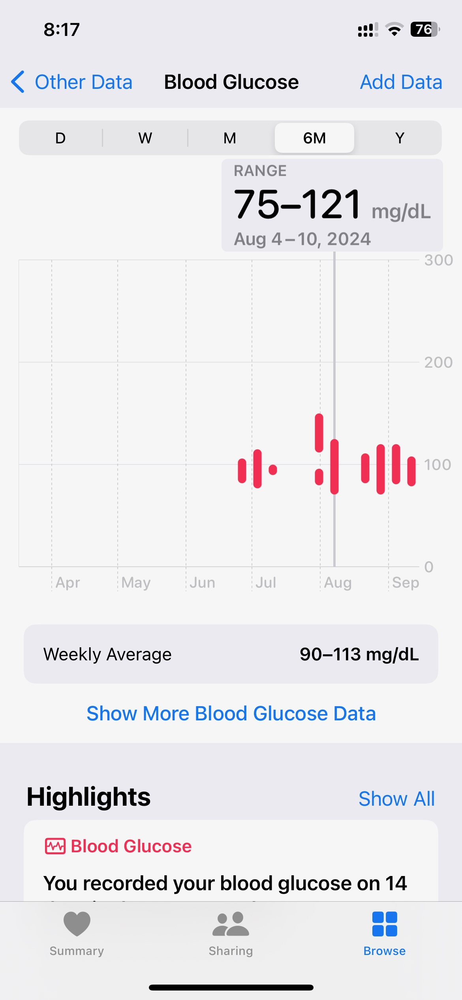
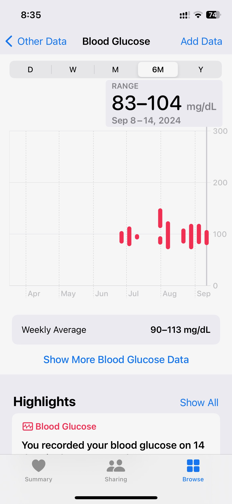

## Tracking Tools

I'm now using the [One Drop app][] to log and track my blood glucose. While the app is a tad too noisy for my taste, it's "journey" view is pretty cool and gives an estimated HbA1C measure (sweet! ;) ).

[One Drop app]: https://onedrop.today/

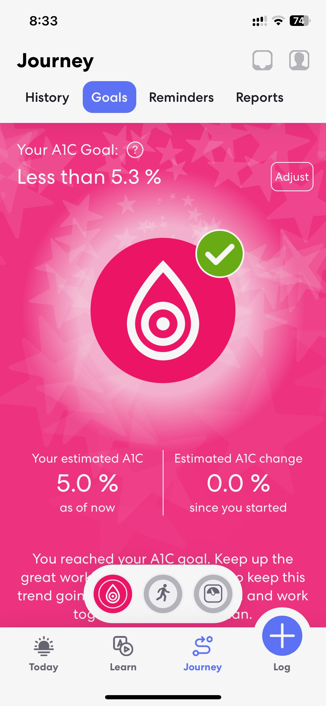

## Equipment

As I mentioned in my previous post, the fantastic, cozy gym in my apartment was unfortunately no longer sufficient for my workout needs.

I got lucky. A super well equipped, clean, well-staffed Gym opened up recently, close to where I live. If you live in Chennai, near the Injambakkam area, [check these folks out][DJ]. They rock!

[DJ]: https://djfitnessstudio.in/

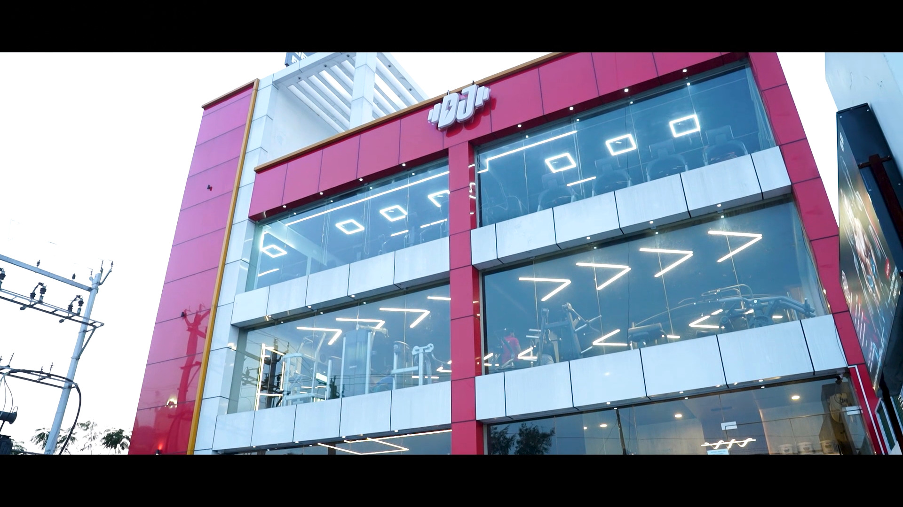
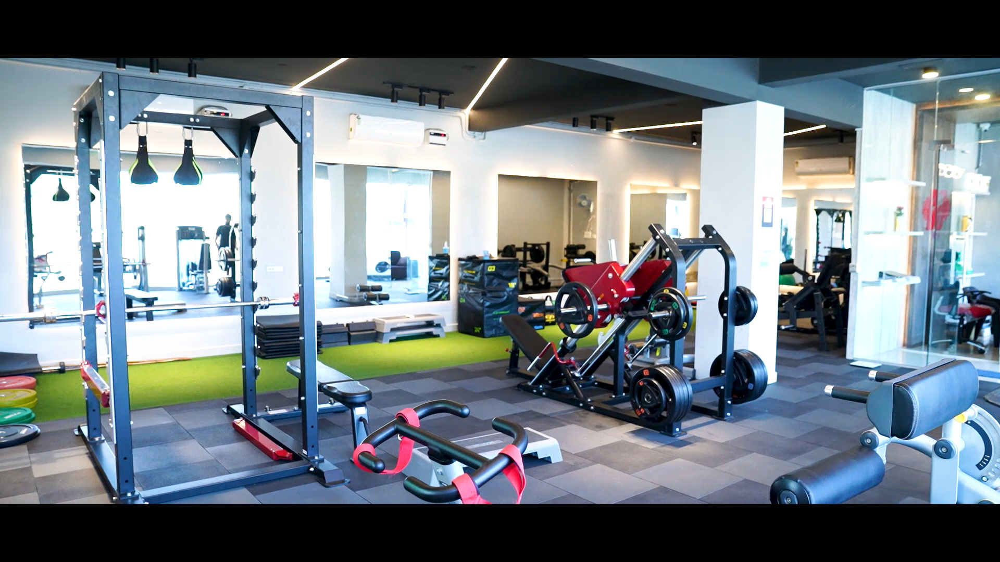

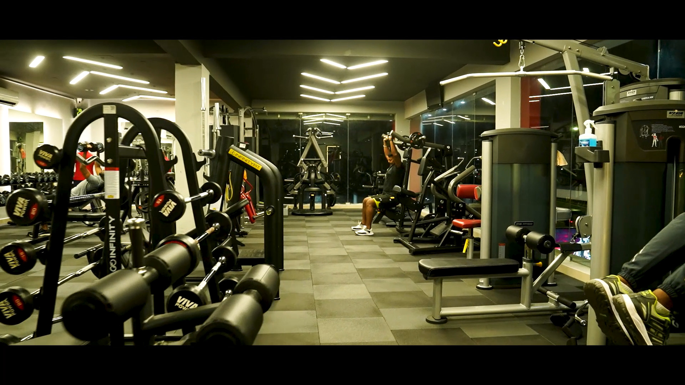
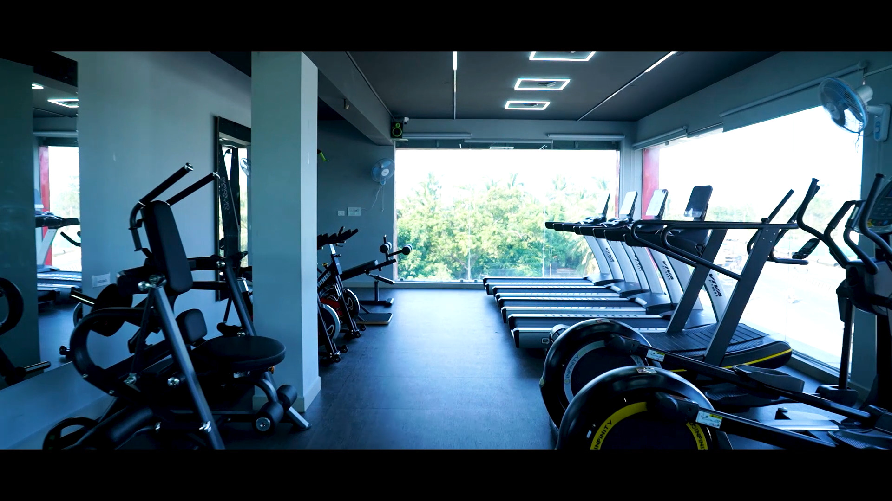

## Next Steps

I have around 3 Kgs more to lose and quite some muscle to build. There is just over a month left before I go for my next assessment to get free of medication.

I've been tweaking and tuning my workout routine over the past few weeks and have an efficient, effective and something that will work not just to meet my current goals, but also as a way to maintain an active life-style for the next decade.

I will share my workout routine in the next installment of this series. I also have exciting updates coming up on other fronts. Stay tuned.
