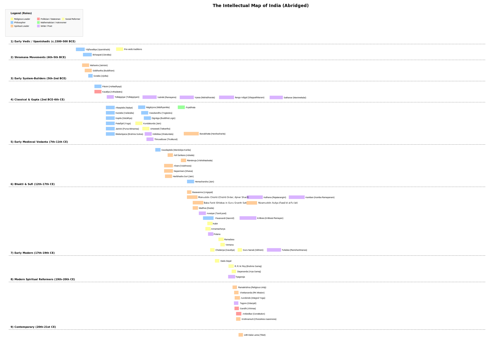

$)

<!--more-->

As a youthful population blooms alongside a turbulent and hyper-polarized world, there seems to be an unasked and unaddressed but widely misunderstood answer to the question "What makes India, India?". In this article, I aim to arrive at an answer through the lens of her intellectual products, use that answer to understand the present a bit more clearly and paint a picture of a possible future that builds upon this glorious past without having to travel back in knowledge, time and progress.

## An approximate chronology

The vastness of the land we now call India in terms of time and space makes her hard to understand. Any attempt to define her tends to confine her to something far lesser than what she is. How do we understand her without diminishing her?

You can view a condensed map of an intellectual India below (zoom and pan to view details). While I'd love to see and present a complete map, limited by my interests and knowledge, this nevertheless is extremely useful and sufficient for the arguments that I will put forth. If you have any corrections or major additions you'd like to see, please [email me](@mailto:navilan@folds.in) and I will take them into consideration.

<small>
Note: This section introduces in a crisp fashion the many ideas in the map without going into details. I will expound on some of these where necessary in later parts. If you are curious and have the time, you can follow the links into rabbit holes and you'll come away with a better understanding.
</small>

The Indian intellectual produce as illustrated by the above map is a symbol of continuous evolution and extraordinary richness. The [pre-vedic][] religious traditions and symbolisms are still entwined in a majority of Indian lives. The [vedas][] codified rites, rituals and procedures to be followed to atomic precision. The [upanishads][] attempted to explore and crystallize the philosophical essence of the rituals in the vedas and beyond them.

[Bṛhaspati][], [Siddhartha Gautama][], [Mahavira][] and the [Shramana][] traditions rejected the rituals but embraced the philosophical inquiry of the upanishads to dive deep into the true nature of consciousness and existence. [Nyāya][], [Vaiśeṣika][], [Sāṃkhya][], [Yoga][], [Pūrva Mīmāṃsā][] and [Uttara Mīmāṃsā][] indulged in deep exploration of nature of physical and metaphysical things, body, mind, ethics, logic and consciousness.

[Bhakti movements][] built on the transformational effects of soulful music, devotional lyrics and transcendental love to unite vast communities of people. [Shankara][], [Ramanuja][] and [Madhava][] engaged in rigorous debate into the nature of consciousness to found schools of thought, towering musical and literary accomplishments that permeate the Indian psyche to this date.

[Taxilla][], [Nalanda][] and [Vikramashila][] became universal centers of learning that flowered and spread seeds of learning throughout the world, the echoes of which you can hear in and as nations far and wide. Atheism, Monotheism, Polytheism, Monism, Dualism, Atomism - you can find every flavor argued, dissected, embraced, rejected and eventually integrated.

This was the pluralistic intellectual peak of the land we now call India.

[pre-vedic]: https://en.wikipedia.org/wiki/Pashupati_seal
[vedas]: https://en.wikipedia.org/wiki/Vedas
[upanishads]: https://en.wikipedia.org/wiki/Upanishads
[Bṛhaspati]: https://en.wikipedia.org/wiki/Charvaka
[Siddhartha Gautama]: https://en.wikipedia.org/wiki/Gautama_Buddha
[Mahavira]: https://en.wikipedia.org/wiki/Mahavira
[Shramana]: https://en.wikipedia.org/wiki/Shramana
[Nyāya]: https://en.wikipedia.org/wiki/Nyaya
[Vaiśeṣika]: https://en.wikipedia.org/wiki/Vaisheshika
[Sāṃkhya]: https://en.wikipedia.org/wiki/Samkhya
[Yoga]: https://en.wikipedia.org/wiki/Yoga
[Pūrva Mīmāṃsā]: https://en.wikipedia.org/wiki/Purva_Mimamsa
[Uttara Mīmāṃsā]: https://en.wikipedia.org/wiki/Uttara_Mimamsa
[Bhakti movements]: https://en.wikipedia.org/wiki/Bhakti_movement
[Shankara]: https://en.wikipedia.org/wiki/Adi_Shankara
[Ramanuja]: https://en.wikipedia.org/wiki/Ramanuja
[Madhava]: https://en.wikipedia.org/wiki/Madhva
[Taxilla]: https://en.wikipedia.org/wiki/Taxila
[Nalanda]: https://en.wikipedia.org/wiki/Nalanda
[Vikramashila]: https://en.wikipedia.org/wiki/Vikramashila

## A fragmented landmass and the rise of its intellectual monuments

Every discourse about India leads us to its fragmented nature. The many languages, religions, sects and traditions. In order to understand India, we need to understand why and how this landmass became and remained fragmented.

The impassable mountains in the north gave rise to magnificent rivers and fertile plains. However, the existence of a few mountain passes allowed raiders and settlers from the northwest to continuously ravage the productive and wealthy lands. These frequent raids made empire building impossible. Shifts of power and redrawing of geographical boundaries was the norm, resulting in fragmented fiefdoms and distinct cultures.

The Vindhya mountains and the highlands of deccan plateau, along with the ghats, isolated the southern landmass. The coast connected cultures and lands physically farther but easily navigable. This combination of physical isolation and ample trading opportunities allowed the south to flourish independently. However, the diverse landscape and the lack of navigability in the rivers and terrain gave rise to multiple power centers and eventual fragmentation of the southern lands.

<a title="Rajendra_map_new.png: The original uploader was Venu62 at English Wikipedia.
derivative work: Gregors, CC BY-SA 3.0 &lt;http://creativecommons.org/licenses/by-sa/3.0/&gt;, via Wikimedia Commons" href="https://commons.wikimedia.org/wiki/File:Rajendra_map_new.svg" style="text-align:center; margin:auto 0; display:block">
    The Chozha empire under Rajendra Chozha
</a>

The varied and fragmented power centers across the landmass prevented a grand unification until the colonial era when technological advancements helped ease navigability across the landmass. Despite the fragmentation, there was a constant and rich exchange of ideas happening all the time. Traders, missionaries, pilgrims, poets, storytellers and the resultant viral spread of schools of spirituality and philosophy contributed to a thriving intellectual factory.

This fragmented landscape encouraged healthy competition among the kingdoms to showcase their intellectual and economic prowess through currencies of status - establishment of religious buildings, patronage of higher order works of poetry, literature, music and art.

## A cradle of creativity, a nursery of ideas and an ecosystem of inquiry

[Vedic Sanskrit][] (like its sibling [Avestan][]) was a well defined but only a spoken language for a large part of its existence. It got its own scripts much later.

The early scholars had the difficult job of communicating vast swaths of accumulated knowledge so that priests and missionaries can travel through these fragmented landscapes to serve their patrons. The vedas emerged from this requirement, elaborate rituals codified in verses, transferred to others through recitation and memorization.

[Vedic Sanskrit]: https://en.wikipedia.org/wiki/Vedic_Sanskrit
[Avestan]: https://en.wikipedia.org/wiki/Avestan

Every new brain learning these verses was a papyrus to write on. A mistake there will propagate across the lands. This phenomenon of the chinese whisper had to be circumvented. So, [rigorous learning](../2024/2024-07-18-learning-from-the-past#a-fantastic-system-of-learning) of the vedas from a very young age was undertaken with a strenuous regimen of pitch perfect, syllable intact recitation. Further care was taken to prevent mistakes by enshrining the very utterance of each syllable as a sacred note with divine energy.

The patrons, the wealthy kings who wanted [yajnas][] to be performed were always in need of the next priest that could do that. This created a thriving economy, provided high status for those that can recite these rituals to perfection and hence carry out the procedures whenever needed. However, the booming practice brought in a big slump in intellectual progress. The economic viability of read and recite transformed into a deep void. There were no longer people that could think and create.

[yajnas]: https://en.wikipedia.org/wiki/Yajna

From this void flowered several beautiful flowers. The first of which were the Upanishads. The scholars of that time realized the onset of the void and started requiring a deep inquiry into the rituals for scholarship. An understanding of the why behind the how, a quest for truth.

In parallel, there were those that rejected the idea of limiting the seeking of this truth to just the vedas. Bṛhaspati led the pack with his materialistic Cārvāka(Lokāyata) school of thought. The Shramanas, dissatisfied with Bṛhaspati's radical submission to skepticism, evolved schools of thought that embraced the divergence from the vedas but rejected the utilitarian tendencies in favor of the spiritual high ground of seeking the truth within oneself through asceticism.

Rejection of vedic knowledge dissolved the power of those that were ritualistic experts. The production and popularization of epistimelogic texts in Buddhism and Jainism elevated the place of Shramana traditions among the masses and the elite.

To rise up to this challenge, the vedic philosophers founded and developed the 6 darshanas. During this period the various schools engaged in critiques of each other's works, further enhancing the potency of their schools as well as the argumentative tradition of the "Indian" inquiry into the nature of truth.

Adi Shankara, clearly inspired by many of the Buddhist principles, but with a keen disdain for certain aspects that he attributed to a nihilistic outlook, brought the monistic Adwaita as a major force and swept through the nation with debates, treatises and force, annihilating the buddhist strongholds.

## The only constant

Just as Shankara captured a massive mind-share among the populace with his Buddha like travels, the virally appealing Bakhti movement began. A century later, Ramanuja, is believed to have burst into tears learning that Adwaita proposes that you cannot attain liberation through devotion.

Just as nihilism became the reason for the switch from Buddhism to Adwaita, Bhakti became the instigating force for the emergence and popularization of Vishistadwaita, which allowed for Bhakti as a potential path to liberation through qualified non-dualism. Ramanuja also broke away from Sankara and the Vedic traditions in disqualifying the varna system as a gatekeeper.

Later on, Madhava takes this further by propounding that true Bhakti is not possible in a monist or qualified-monist framework and hence establishing one of the very first dualist frameworks in Dwaita. He also brought back the Varna system as a mainstay in his philosophies.

It is important to note that each of these transition periods relied on extensive argumentation, interpretation and re-interpretation of texts from competing and ancestral schools of thought, and persuasion of the masses through public debates and published critiques.

These extraordinary thinkers were supported by the patronage of the philosophically inclined rulers, a relatively peaceful period, a thriving economy, an experimental society & an open, scientific culture.

## The dark ages

Dark ages are unavoidable. They are a part of every intellectual and industrious civilization. They are also fantastic teachers. By gaining a good understanding of the onset, extension and eradication of every dark age, we can avoid the pitfalls that may lead us to another or recover from the one we are in. History always rhymes and occasionally repeats.

One of the puzzling pieces of this land is how The East India Company with only a handful of soldiers was able to hire the natives, pit them against each other and use them to capture their own land. How could a land of such intellectual superiority fall into such disorder?

In order to understand this let's take a short detour.

### Parthenogenesis in Daphnia

Daphnia, a crustacean plankton species switches between sexual reproduction and parthenogenetic reproduction based on environmental conditions.

<small style="opacity: 0.5; text-align: center; margin: auto">
By Author=<a href="//commons.wikimedia.org/wiki/User:Ditaviz" title="User:Ditaviz">Dita Vizoso</a> - Own work, <a href="https://creativecommons.org/licenses/by-sa/3.0" title="Creative Commons Attribution-Share Alike 3.0">CC BY-SA 3.0</a>
</small>

When conditions are favorable, that is, there is no risk of extinction (period of growth), reproduction is done using parthenogenesis (cloning). We can understand the logic: don't fix what ain't broke. However, when there is a risk (no growth), the organism reverts to sexual reproduction with a hope that the mutations from sexual reproduction may give rise to traits that help with the survival of the species.

The same applies to societies, ideas and philosophies. When they are not challenged, they revert to parthenogenesis, forming static societies that cling to their ways and do not change.

### What happened?

In order to understand how this glorious, sprawling civilization with unparalleled intellectual curiosity spiralled into intellectual deficit, powerlessness and economic downfall, we need to visit a few conditions that may have contributed to the complete stop in the continuous social movement of ideas that we have seen above.

1. Loss of Patronage: Epistemological reasoning, like most intellectual endeavors is a cost center requiring patronage. When the landmass was ravaged by captors with their own traditions, the patronage ceased and progress stopped.

2. Survival Mechanisms: When the loss of power was inevitable, the society decided to give up the land which can be conquered back and made a choice to preserve tradition and culture. The opposite of the evolutionary choice made by Daphnia.

3. Loss of Reason: When the society reverted to conservation under deficit and oppression, the easiest thing to preserve were the rituals - well codified, orally transmitted to perfection. Designed for survival. However, the tradition of inquiry, the rigorous argumentation, the quest for truth was lost in this fight for survival.

4. Unfavorable Social Technology: The well established later-varna systems further divided and specialized the society. Very few people possessed the knowledge to advance or even rekindle this culture of inquiry.

5. Poor Genetic Technology: The varna system was a technology that actively prevented favorable mutations under threat. While it worked well during times of peace, replicating successful formulae, it prevented mutations that could have provided a better genetic pool.

To rebuild this land, to revitalize the intellectual pool, to rekindle the intellectual progress, a good model of this has to be understood and plans to address the deficits have to be charted and put in place.

## What is India?

The fragmented land was geographically unified, ironically by her captors and at their unavoidable retreat, seeds of distrust were sown to stall progress.

So, what truly unifies this fragmented land?

Is it Karma? The account keeping that is widely accepted? Not quite. If it were so, Krishna would have told Arjuna what was awaiting him, most of his brothers, and Krishna himself after the war instead of the Bhagvad Gita. Ramanuja would not have gone to the top of the temple to [scream out the Gayatri mantra to everyone](https://www.thehindu.com/features/friday-review/Ramanuja%E2%80%99s-revelation-of-the-%E2%80%98secret-mantra%E2%80%99/article14550905.ece).

Is it Varna? The hierarchical system of social responsibilities? Can't be. It will disenfranchise all the Shramana traditions and all the people that practice true Vishishtadwaita.

Is it Dharma? The system of rules established by the vedas and expounded in later literature? Not quite. The Vedas were continuously interpreted and it will be impossible to come to a conclusion on "What is Dharma" if we bring together all the sects. Here is a clip of someone more decorated than me stating it:

<iframe src='https://www.youtube.com/embed/X5LHwS9iYKU?start=405&amp;end=415' frameborder='0' allowfullscreen>
</iframe>

[The entire video](https://www.youtube.com/watch?v=X5LHwS9iYKU&t=1s) is well presented and a great watch if you are interested in this topic.

Is it Bhakti? It even brings together Sufis alongside Vaishnavites and Shaivites. However, it becomes a problematic concept in Adwaita and is unfavorable in Shramana traditions.

Yet, there is something unifying about all of this. What is it? What makes India, India?

<section id="mimamsa"></section>

I propose: Mimamsa. Here, I'm not talking about "Purva Mimamsa" or "Uttara Mimamsa", but the general idea of Mimamsa. Reflection. Investigation. Inquiry. The eternal quest for truth. To find the meaning of it all. That has been the driving force of the existence of this exquisite land. It unifies the Vedics, the Shramanas and the pre-vedic traditions.

By accepting "Mimamsa" as the unifying idea behind India, we also reignite the culture of the pursuit of truth. What is this truth? How do we go about it?

The later vedics tried to find this truth in the Vedas. They interpreted, re-interpreted, debated those interpretations, critiqued the interpretations, clarified their ideas. The Shramanas tried to find this truth within themselves through meditation and asceticism. Tiruvalluvar mentions this truth:

> எப்பொருள் யார்யார்வாய்க் கேட்பினும் அப்பொருள் மெய்ப்பொருள் காண்பது அறிவு
>
> &mdash; Thirukkural, 423. Thiruvalluvar.
>
> Intellect is defined by a quest for truth regardless of the source.

 

According to Smyslov, truth can be found in Chess.

> In chess I am also a staunch supporter of classical clarity of thought. The content of a game should be a search for truth, and victory a demonstration of its rightness.  &mdash; Vasily Smyslov

 

The creative samurai Miyamoto Mushashi finds his truth in swordsmanship:

> Truth is not what you want it to be; it is what it is.
And you must bend to its power or live a lie.  &mdash; Miyamoto Musashi

He goes further and explains why it is _the_ truth:

> From one thing, know ten thousand things. What I call the void is where nothing exists. It is about things outside man's knowledge. Of course the void does not exist. By knowing what exists, you can know that which does not exist. That is the void. &mdash; Miyamoto Mushashi

 

For the last philosopher, J. Krishnamurti, it is choiceless awareness:

> This new quality of awareness is attention, and in this attention there is no frontier made by the "me". This attention is the highest form of virtue, therefore it is love. It is supreme intelligence, and there cannot be attention if you are not sensitive to the structure and the nature of these man-made traps. &mdash; J. Krishnamurti.

 

You can look at India as a fragmented land or a fertile land. But you have to consider this: when you remove the fragmentation you lose fertility as well. The key is to bridge the fragmentation while cherishing the fertility.

 

### The beauty of inquiry

A culture of inquiry, Mimamsa, begins by acknowledging the richness and the source of this land's intellectual greatness.

Vedanta, one of the most recent and most popular segment of this intellectual map is often misunderstood as "The end of knowledge" as *Veda* is knowledge and *Anta* is usually the ending. However, *Anta* has other meanings - one in particular is very closely related to inner / root / core / origin. So, in many ways, Vedanta is the inquiry into the root of the Vedas or in other words, a quest to find the truth in Vedas. Hence the alternate name, *Uttara Mimamsa*.

<a title="Javierfv1212, CC BY-SA 4.0 &lt;https://creativecommons.org/licenses/by-sa/4.0&gt;, via Wikimedia Commons" href="https://commons.wikimedia.org/wiki/File:Asoka%CC%A0_Buddhist_Missions.png">
    Ashoka's Buddhist Missions
</a>

When Buddhism declined and faded away from this land, [King Anawrahta](https://en.wikipedia.org/wiki/Anawrahta) had to rely on Ceylon to bring [Theravada Buddhism][] to Myanmar when he decided to take away the power of [Ari monks](https://en.wikipedia.org/wiki/Ari_Buddhism).

Consider this for a second. [Buddhism reached Ceylon][Ceylon] through [king Ashoka's][Ashoka] [son][Mahinda] and [daughter][Sangamitta]. After 700 years, Ceylon becomes the one true source of the original form of Buddhism. It was a distant memory in the land where it was born.

[Ceylon]: https://en.wikipedia.org/wiki/Buddhism_in_Sri_Lanka#Introduction_of_Buddhism_to_the_island
[Ashoka]: https://en.wikipedia.org/wiki/Ashoka
[Mahinda]: https://en.wikipedia.org/wiki/Mahinda_(Buddhist_monk)
[Sangamitta]: https://en.wikipedia.org/wiki/Sanghamitta
[Theravada Buddhism]: https://en.wikipedia.org/wiki/Theravada

In one way, India was the Vishwaguru at that time. In another, it is also the one that forgot its own knowledge. The culture of inquiry, where challenge and critique were the weapons of knowledge, where competing ideas co-existed in a collaborative quest for the ultimate truth, this land was naturally a Vishwaguru. When one philosophy dominated or expunged the rest, the need for inquiry deteriorated and eventually vanished.

### The loss of real institutions

With waves of nationalism and an undercurrent of divisive politics, India keeps trying to find her collective identity without understanding her true roots. Her source of greatness lies in a strong tradition of inquiry. Inquiry into everything from metaphysics to physics, mathematics to music, atheism to asceticism, mindfulness to magnificent epics. To truly believe in the greatness of this land is to embrace all its products while applying the rigorous culture of public critques and passionate debates.

To rebuild this tradition of inquiry, to bring back the glorious past where this land was the cradle of creativity, bastion of knowledge, leader in learning, she needs to bring back the institutions of the past, the plurality in ideas and a persistent focus and patronage of the pursuit of truth.

<a title="Odantapuribs, CC BY-SA 4.0 &lt;https://creativecommons.org/licenses/by-sa/4.0&gt;, via Wikimedia Commons" href="https://commons.wikimedia.org/wiki/File:Temple_No.-_3,_Nalanda_Archaeological_Site.jpg">
    Nalanda Mahavihara
</a>

Nalanda of the past was not just a collection of expensive buildings, but home to people that birthed new ideas with a single minded pursuit of their truth - truth in their areas of interest, proficiency and wisdom.

India's current system of learning resembles the read and recite traditions that were required in the Vedic times. She has forgotten that her true greatness lies in creating new things, generating new ideas and engaging in grand inquiries to find new truths. That's why we believe we are building [the next Nalanda](https://puthir.org). [SocratiQ](https://socratiq.ai) is our dedication to what we believe defines India: Mimamsa.
